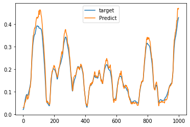
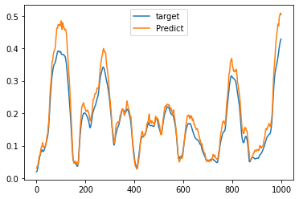
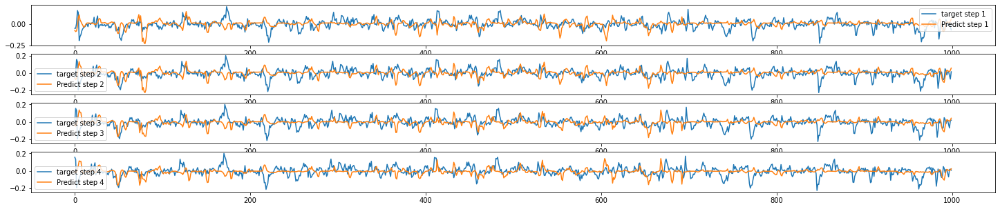

# [Home](http://lu0x1a0.github.io)

## Current Task:
* Display Live Streaming Data from IG and aggregate to historical data
* make qtplot accept jupyter data

## Current Bug:
streaming data saved some very weird residual? 
i.e. 
```
,time,Open,High,Low,Close
0,2022-01-04 10:56:00,1.1296300000000001,1.12964,1.12952,1.1295250000000001
1,2022-01-04 10:57:00,1.1295350000000002,1.12962,1.12947,1.12948
2,2022-01-04 10:58:00,1.12949,1.12962,1.12946,1.12948
3,2022-01-04 10:59:00,1.12949,1.1295549999999999,1.1294650000000002,1.1294650000000002
4,2022-01-04 11:00:00,1.129475,1.129505,1.129235,1.1292900000000001
```

# Requirements
install conda environment from the environment.yml file via
```
conda env create -f environment.yml
```
or
```
conda env create -f environment.yml -p /home/user/anaconda3/envs/env_name
```
environment.yml is created via
```
conda env export | grep -v "^prefix: " > environment.yml
```

# How to visualize:
Data used in this repository are obtained [here](http://www.histdata.com/download-free-forex-data/?/ascii/1-minute-bar-quotes)

Run newqt.py, in MainWindow class change between Test1plot (minutes) and Test2plot (hourly)


# Predictions: 1 step Predition of test data for Dema_9-rolling_Standard Deviation_100 on Hourly data

details inside 1stepprediction.ipynb





# Preliminary 4 step prediction on scaled D1EMA100 on Hourly Data, 300 epochs
details inside d1multistep notebook

D1 means price[hour = i]-price[hour = (i-1)]


## Discussion
The network can still improve further by adjusting learning rate, but the data source seems to be too noisy at small window scale.  Might consider smoothing it for prediction showcase. Or jump straight to reinforcement learning of entry leaving signals. 

Also suspecting that the loss of 1+n step is probably decreasing the learning speed of 1 step. s

#### Note This repository has a lot of redundant code reused from a past repo and codes inside ipynb are most likely obsolete.

