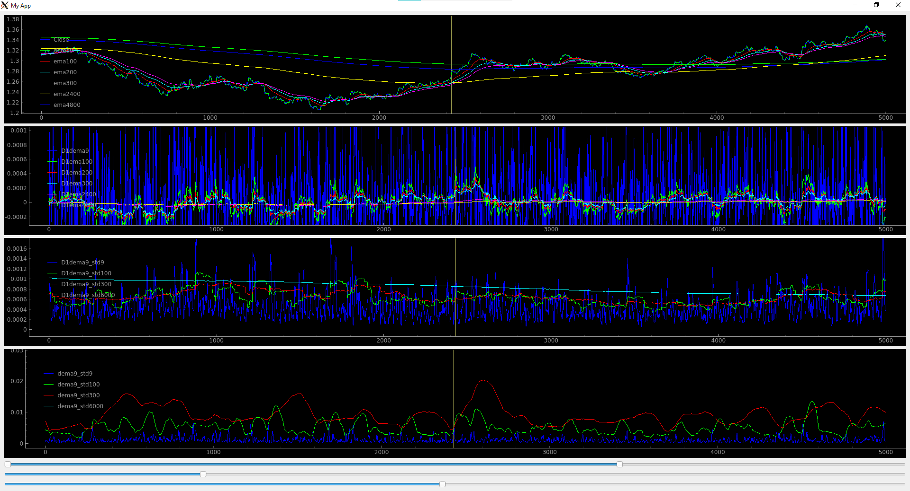

# How to visualize:
Data used in this repository are obtained [here](http://www.histdata.com/download-free-forex-data/?/ascii/1-minute-bar-quotes)

Run newqt.py, in MainWindow class change between Test1plot (minutes) and Test2plot (hourly)

#### Note This repository has a lot of redundant code reused from a past repo and codes inside ipynb are most likely obsolete.

